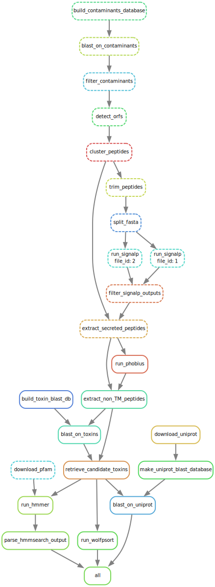

# DeTox pipeline
## snakemake porting
---

## stuff to be done:

- [ ] port C pattern recognition
  - [ ] split mature peptides
- [ ] port repetitive patterns flagging
  - [ ] split mature peptides
- [ ] port merging of all results in a single table
- [ ] port scoring

## current status of the port graph:

